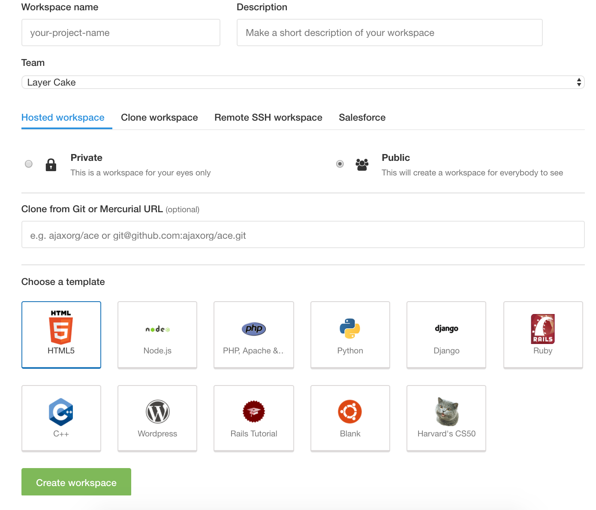
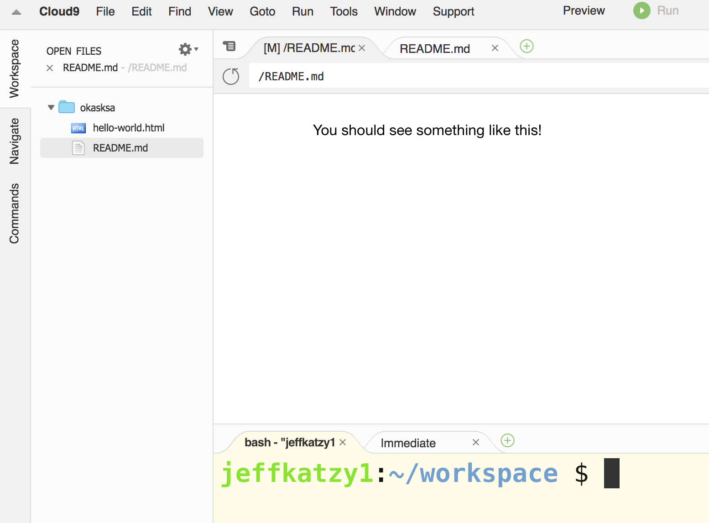

### Getting Setup with Cloud9

Ok, now it's time to start building things.

### Getting Setup

To do so, we'll need to use a text editor.  Think of a text editor like Microsoft Word.  The only different is that instead of writing word documents, we use it to write code.

An excellent free option that many professional developers use is Cloud 9.  You don't need to download anything, but you do need to sign up.

### Signup

*  [Sign Up](https://c9.io/signup) for Cloud 9 by going to *https://c9.io/signup*.  Or, if you already have an account, [Sign in](https://c9.io/signin) by going to https://c9.io/signin.

### Create a new project

Now you need to create a new project.  To [create a new project](https://c9.io/new) go to https://c9.io/new

You should see a form to fill out on the page:

* Enter the workspace name.
* In the field "Clone from Git or Mercurial Url" type in the codebase you will be copying:
* Finally, click on create workspace.

After you do so, you should see something that looks like the following.

Great job!

**up next** [writing html](./writing_html.md)
