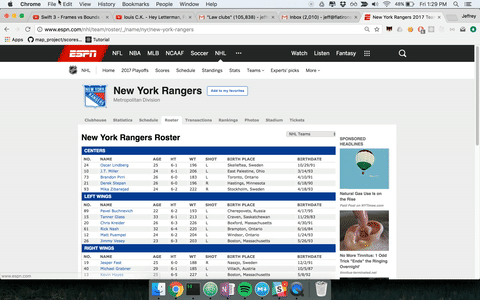
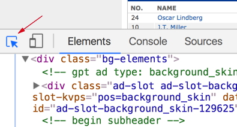
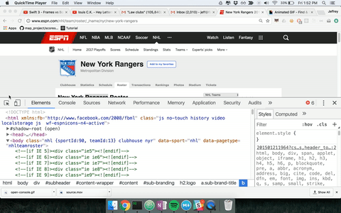
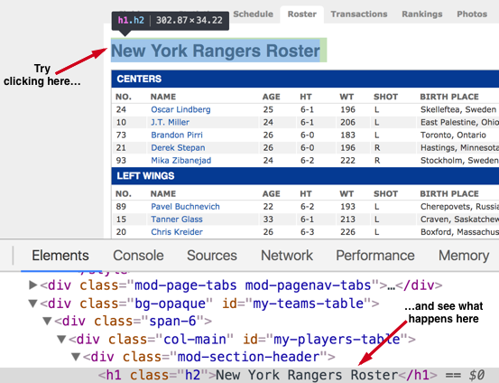

### First, guess it out

Answer with the person sitting next to you.  

1. What is HTML?  
2. How does the image on the right of our wikipedia article relate to what you just read?

### Read less, do more 

Go to [espn](http://www.espn.com/nhl/team/roster/_/name/nyr/new-york-rangers) again.

#### 1. Open the console 

	
> From the espn webpage, look at the menu at the chrome menu at the top of the page, and click on *view*, then at the very bottom of the view dropdown it says *developer*.  Upon clicking on developer at the bottom of that you will see *Developer Tools*.  Click on Developer Tools.  This will pop up the Google Developer Console.  (A quicker way to open up the console in the future is to press command+shift+i).  

#### 2. Try to manipulate the Webpage

We'll get you started.  

Make sure that the icon at the top left of the developer tools is highlighted, as you see below. 

Then, move your cursor over different parts of the page.  Notice what happens to the chrome inspector.  

Now what happens if, with the top left icon still highlighted, you click on an image or text in the webpage of interest to you.  

How does the highlighted information relate to the content you clicked on?

Then, click on and highlight the related HTML below.  And press delete.  What happened to the page displayed?

Can you highlight other HTML and manipulate the webpage through the HTML in other ways?

### Change your mind

Now, with a partner, take another shot at the same questions.  

1. What is HTML?  
2. The image in Wikipedia displays HTML.  How does that line up to your understanding of what HTML is?

