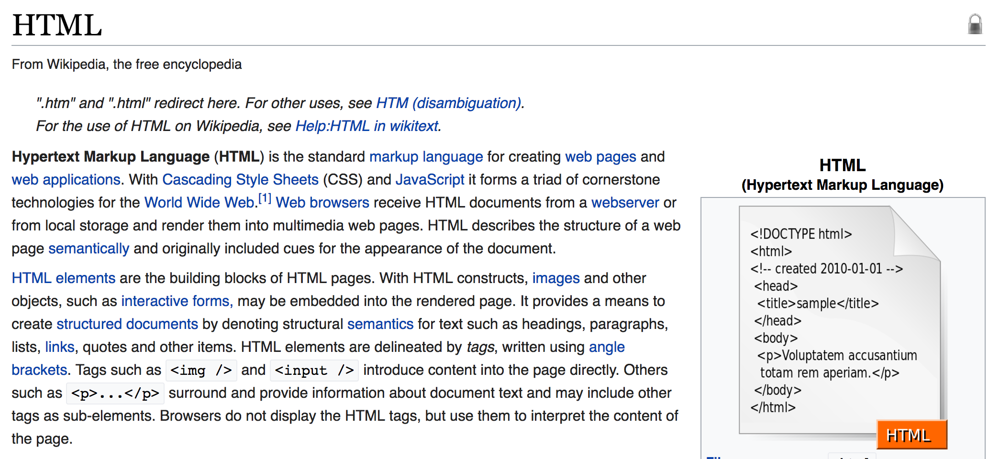

# HTML

### How html fits in

[Click here.](http://www.espn.com/nhl/team/roster/_/name/nyr/new-york-rangers)

Ok, so if a website works by using sql, ruby, and HTML, let's zoom in on the HTML piece.

### Exploring html

HTML is a core component of the world wide web, and was invented by Tim Berner's Lee in 1989.

First, let's read a little bit about HTML, and then we'll explore it directly with our browser.

1. [Read about](http://webfoundation.org/about/vision/history-of-the-web/) how and why Tim Berner's Lee created HTMl.
2. Now let's see what Wikipedia has to say, focusing in on the second paragraph that second paragraph.

Ok, now what does this all mean?

**up next** [html activities](./html_activities.md)
