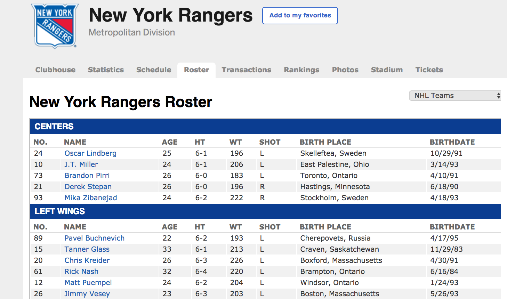

### Our Aim: Learn how it all works

[Click here.](http://www.espn.com/nhl/team/roster/_/name/nyr/new-york-rangers)

Don't get distracted.

Our aim in this class is to learn one thing: how our ESPN website works.  In doing that, we'll learn how every website works.

Well, let's just tell you.

A website works by using: 

1. **Sql** to retrieve data stored on a computer   
2. **Ruby** (or another programming language) to make calculations on that data, and 
3. **HTML** to present the information to a user    

Now, we need to learn what all of this, sql, ruby and HTML stuff means.  

And all of that, somehow turns into our website above.