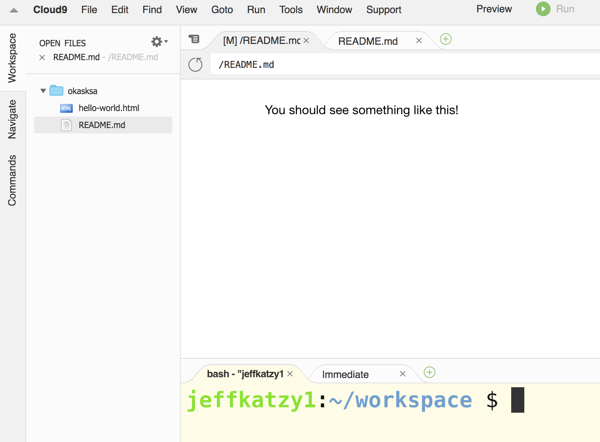

# Writing HTML

### Recap

So by now, we begin to understand that HTML is a language to structure content to be displayed to a browser.  Browsers display content differently based on this structure.

### Writing HTML

Now it's finally time to write our own HTML.  Mozilla provides excellent documentation on HTML.  Let's take a look at some of their documentation.

[Mozilla on HTML](https://developer.mozilla.org/en-US/docs/Learn/HTML/Introduction_to_HTML/HTML_text_fundamentals)

Mozilla focuses us on two different elements.  Headings and paragraphs.  That's good enough for now.  

Use that document as a reference, and it says about paragraphs and headings to create an HTML document that looks like the following.

> Your future creation.  No, it won't win any awards, but we're just getting a sense of what HTML is about.

### How to get started

1. Go to [Cloud 9](https://c9.io/).
2. Click on create new workspace.  You should see something like the following: 

	

3. Enter a workspace name, ensure the HTML5 template is highlighted and click Create Workspace.  You should see something like the following: 

	
	
4. Now begin to edit the hello-world.html file.  Click on the file on the left hand side fo the screen.  Then remove the contents of the file, and begin to replace with your own code.

	
	
5. To check if your code is correct, first click on the green Run button at the top of the page.  This will open a new window at the bottom of the page with a link to the display of your code.  
	
	

Click on that link or copy that link into a new tab in your browser.  

Continue to make edits to your HTML and then refresh the link displaying your code until it looks something like the following: 

Then you are done.

